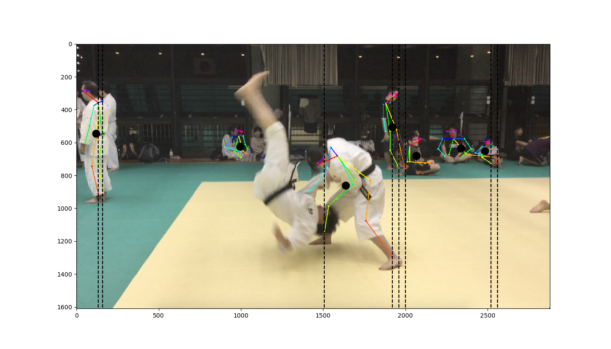
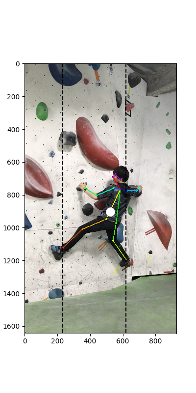

# what is this
Activity to evaluate some kind of sports moves with tf-pose-estimation.

    
     
    Testing for movies to estimate the Center of Gravity

    
     
    Picture Sample

    
     
    Picture Sample of Vertical

# Functions

1. apply pose estimation to your photos and save it
2. apply pose estimation to your movies ,encode and save it

# Trial
You can run this casually on google colaboratory FREE!!

English: https://colab.research.google.com/drive/1kUVQSmWSJ3aBpbh83NNbUHbEA0IQqufy

日本語: https://colab.research.google.com/drive/1VO4TGJHKXnRKgiSAsNEeQcEHRgzUFFv9
